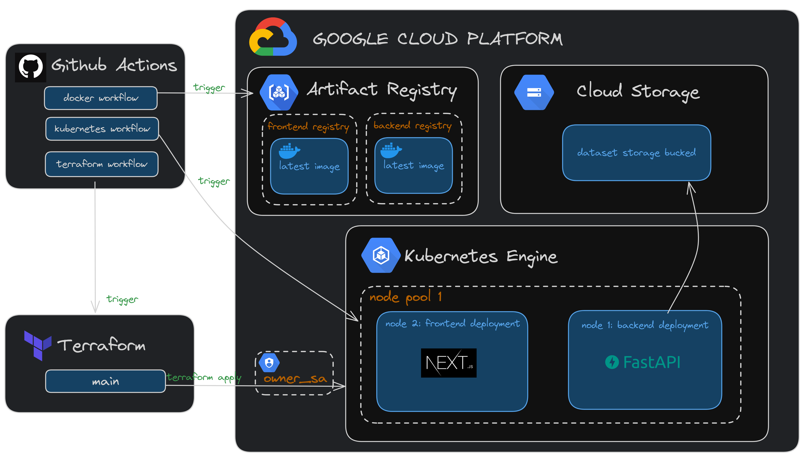

# AutoMate-ML

<!-- TODO: add in repo badges once project starts-->

    

 

   

## The AutoMate Architecture

## Contributors

| 
 Contributor 
                                                    | Most Used Frameworks/Tools                                                                                                                                                                                                                                                                                                   | Notable Contributions                                                                                                                                                                                                                                                                                                                           |
| ----------------------------------------------------------------------------------------------- | ---------------------------------------------------------------------------------------------------------------------------------------------------------------------------------------------------------------------------------------------------------------------------------------------------------------------------- | ----------------------------------------------------------------------------------------------------------------------------------------------------------------------------------------------------------------------------------------------------------------------------------------------------------------------------------------------- |
|    **Rawan Mahdi**   <i/> Project Manager & DevOps </i>   |  |||
    **Mohammed Abed**   <i/> Full-stack Developer </i>|    |  <ul><li>[#168: Implemented Upload and Retrieval of Data from GCP Buckets](https://github.com/DSC-McMaster-U/Auto-ML/pull/168)</li><li>[#133: Wrote K8s Manifest for Backend](https://github.com/DSC-McMaster-U/Auto-ML/pull/133)</li><li>[#93: Frontend Root Layout Component](https://github.com/DSC-McMaster-U/Auto-ML/pull/93)</li></ul> |
|    **Raymond Tao**   <i/> Backend Developer </i> |  |  
   **Nicole Sorokin**   <i/> Frontend Developer  </i>   |    |<ul><li>[#80: Developed Frontend for Data Upload Page](https://github.com/DSC-McMaster-U/Auto-ML/issues/80)</li><li>[#141: Refined and Enhanced Frontend Styling](https://github.com/DSC-McMaster-U/Auto-ML/issues/141)</li><li>[#152: Implemented Data Preprocessing for AutoML Module](https://github.com/DSC-McMaster-U/Auto-ML/issues/152)</li><ul>
    **Austin Bennett**   <i/> Cloud Architect & Backend Developer </i>   |   | <ul><li>[#55: Designed Containerized Application and Cloud Architecture](https://github.com/DSC-McMaster-U/Auto-ML/pull/55)</li><li>[#128: Wrote K8s Manifest for Frontend](https://github.com/DSC-McMaster-U/Auto-ML/pull/128)</li><li>[#132: Created Workflow to push K8s Manifest to GKE cluster](https://github.com/DSC-McMaster-U/Auto-ML/pull/132)</li><ul> |

## About the Project

<!-- TODO: insert screenshot of application page-->

Automation has been making its way into all industries and services, including machine learning! Automating the training and development of models makes machine learning more accessible to user's with little to no background in ML. It takes the user's task, uses a training dataset to fit and tune models to the desired model metrics, and returns a functioning classification model to the user. Google Cloud provides an [AutoML](https://cloud.google.com/vertex-ai/docs/beginner/beginners-guide) service (which we will be taking major inspiration from), and they define it as below:

> "AutoML enables developers with limited machine learning expertise to train high-quality models specific to their business needs. Build your own custom machine learning model in minutes."

## Project Challenges

Below is a list of challenges that we'll try to address over the course of our project, after developing our MVP. Some of them reflect industry level challenges involving ML services. They may show up as features/issues throughout our project, depending on what stage we're at.

- Distinguish our service from Google Cloud's AutoML
  - make the UI so user-friendly that little to no background in ML is needed to produce a model using our service
- Maintain user's data privacy
  - if cloud training is used, how is the model and the data it was trained on protected on it's journey from cloud to customer
  - secure storage of user's inputted training dataset
- Address common AutoML challenges such as the tendency to overfit when optimizing accuracy through models
- Build our own automated model training service using PyTorch, i.e. implement the service from scratch - this will require members to have knowledge in ML and familiarity with PyTorch
- Incorporate Federated Learning: this is related to maintaining user privacy with cloud training. Federated learning has been a hot topic in ML so it'd be great for us as devs to get our hands on it. Check out [this](https://federated.withgoogle.com/) comic made by google to learn a bit more about the benefits of federated learning. Read [this](https://blog.research.google/2017/04/federated-learning-collaborative.html?m=1) google blog post to learn more if you're interested
