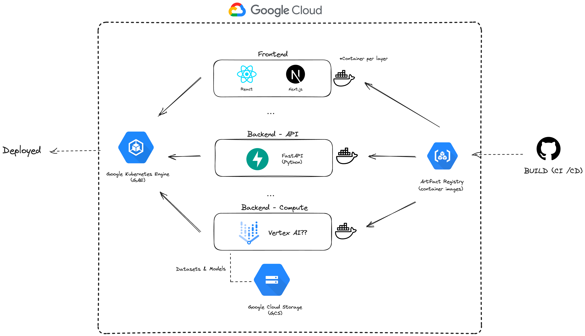

# Cloud Architecture
Overview and possible architecture plan for our application top to bottom.

## IDEA: 
Containerize each layer of our application by seperation of concerns. i.e (Frontend, API, Training) and leverage **Google Kubernetes Engine** to deploy, monitor and manage our multi-container application on the cloud. We will use github actions to build and upload containerized images into a google artifact repository (So GKE can pull and deploy these images)

## Google Cloud Services Definitions

- **Google Kubernetes Engine (GKE)**: Google Kubernetes Engine (GKE) is a managed, production-ready environment for deploying containerized applications. It's a service offered by Google Cloud that allows you to run Kubernetes clusters without having to handle the cluster management tasks such as bootstrapping, maintaining, updating, and scaling.

- **Google App Engine (GAE)**: Google Cloud offers a Platform as a Service (PaaS) called "Google App Engine" (GAE). This fully managed platform allows us to deploy, monitor, and scale applications without the overhead of infrastructure management. The platform offers support for many popular languages, such as Python, Java, Go, Node.js, PHP and Ruby. 

- **Google Cloud Run (GCR)**: Fully managed compute platform for deploying a SINGLE containerized application, can automatically scale compute based on load. Would ease deployment and testing at the cost of some extra configuration upfront.

- **Google Compute Engine (GCE)**: Essentially a hosted virutal machine. We would mainly choose this option over others due to complete control. I can't see us requiring a solution like this however. 

- **Vertex AI**: An end-to-end google cloud platform for deploying and managing machine learning (ML) models. It integrates and extends multiple existing Google Cloud services, like AI Platform Training and AI Platform Predictions, providing tools for the entire ML workflow. This allows developers and data scientists to build, train, and deploy ML models more efficiently.

- **Google Cloud Storage**: Google Cloud Storage is a fully managed object storage service that is highly scalable, durable, and available. It's designed to store and access any amount of data from anywhere on the internet. It's commonly used for storing unstructured data like media content, backup and archival data, and application data.

- **Artifact Registery**:  Artifact Registry is a single place for your team to manage Docker images, perform vulnerability analysis, and decide who can access what with fine-grained access control. Existing CI/CD integrations let you set up fully automated Docker pipelines to get fast feedback.

## I. Google Kubernetes Engine
Google Kubernetes Engine (GKE) provides a managed environment for deploying, managing, and scaling your containerized applications using Google infrastructure. The environment that GKE provides is flexible and allows you to focus on your application rather than managing infrastructure systems.

### Use Case:
Our application may to consist of different layers, each potentially having different resource requirements and scaling behaviors. By using GKE, we can ensure that each layer is abstracted into a container, ensuring separation of concerns, and we can independently scale out these containers based on the layer's specific needs.

For instance, you might have the following layers:

1. Frontend (UI/UX layer)
2. API (Backend processing)
3. Training (Machine learning model training)
   
Each of these layers has different compute, memory, and storage requirements, and they might have different traffic patterns. Using GKE, you can have each of these layers in separate containerized environments, and GKE will manage the scaling (up or down), self-healing (restarting containers that fail), and load balancing across these containers.

Furthermore, GKE's integration with other GCP services allows for an end-to-end solution, where you can leverage Google's networking capabilities, security controls, and logging/monitoring solutions (like Stackdriver) for a comprehensive view of your application's health.

## II. Artifact Registry
Google's Artifact Registry is a managed service that allows you to store, manage, and secure artifacts like Docker container images, language packages, and more. It's fully integrated with Google Cloud's tooling and runtime, making it a natural choice for use with GKE.

### Use Case:

In your CI/CD pipeline, when we use GitHub Actions, we can build our container images and then store them in the Artifact Registry. Since your GKE clusters are on Google Cloud, using the Artifact Registry will reduce the latency for pulling images, as compared to pulling them from a non-Google source. Also, by having your images in the Artifact Registry, you can set up IAM policies on who can access your images, ensuring that only authorized GKE clusters or users can deploy your containers.

## III. Google Cloud Storage
Google Cloud Storage (GCS) is a highly durable and available object storage service. It's designed to store data in the form of objects, which are grouped into buckets.

### Use Case:

- **Storing Application Data:** If your application deals with large amounts of unstructured data (like images, videos, or large documents), GCS is a perfect place to store this data. It provides worldwide access (if needed), and you can control access using Google's IAM.

- **Machine Learning Model Artifacts:** these can be stored in GCS. From there, they can be accessed by your application's other layers or used for further training and evaluation.

